# git几种状态

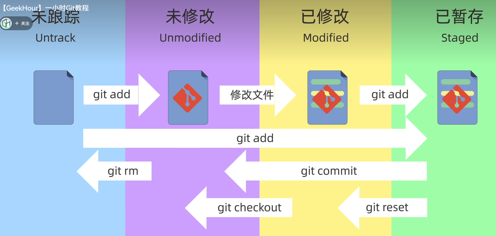

# git reset的三种模式

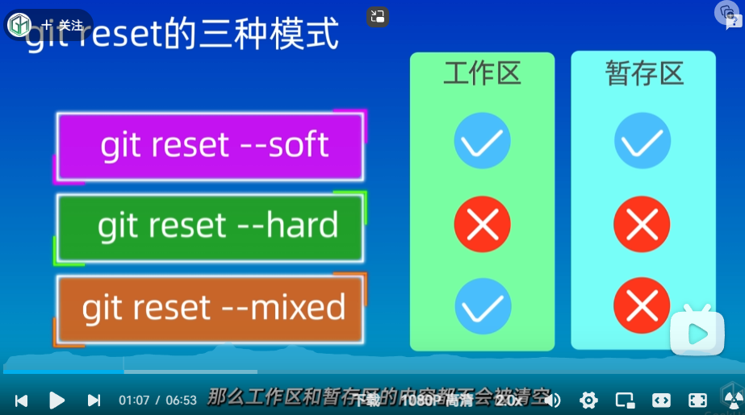

- git reset -- soft  工作区和暂存区回说某一个版本，不会删除工作区和暂存区的内容
- git reset --hard 工作区和暂存区回溯上某个版本，会删除工作区和暂存区的内容
- git reset -- mixed 工作区和暂存区回溯上某个版本，不会删除工作区的内容，但会删除暂存区的内容

# git diff的使用

git中有工作区、暂存区和版本库

- git diff head(比较工作区和暂存区的差异)	head表示当前分支的最新提交
- git diff --cached(比较暂存区和版本库之间的差异)
- git diff其他用法   ~2表示head之前的两个版本

 

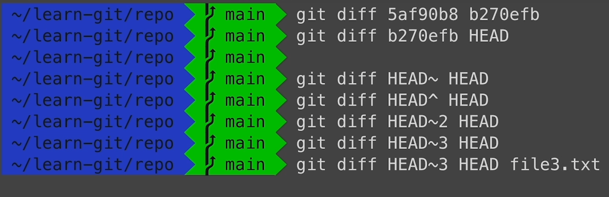

# git删除操作

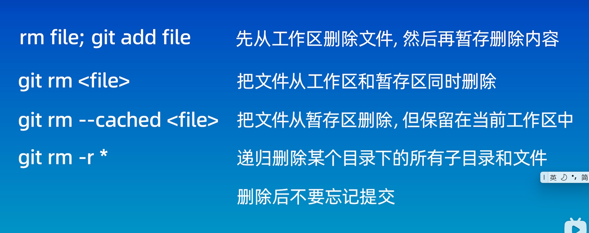

# .gitignore文件的匹配规则

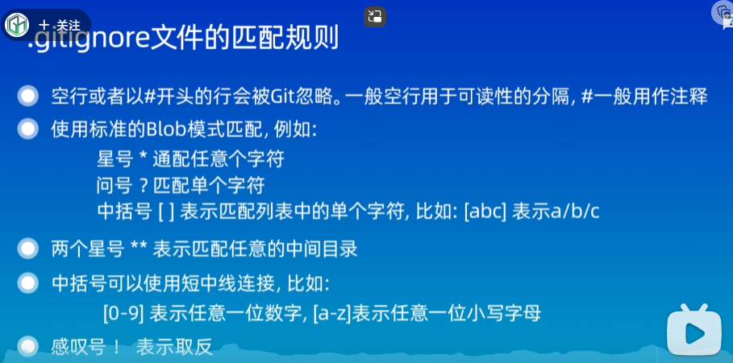

### 列子

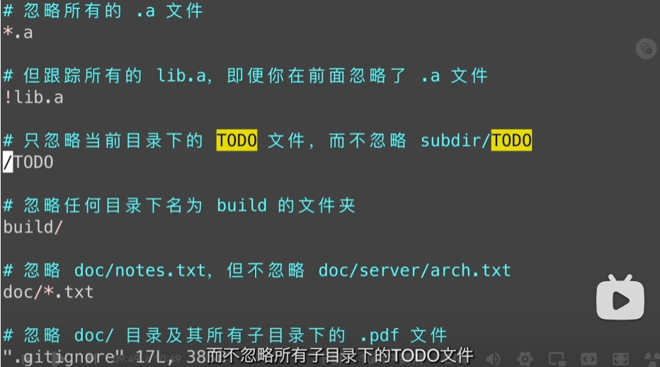

# ssh配置和克隆仓库

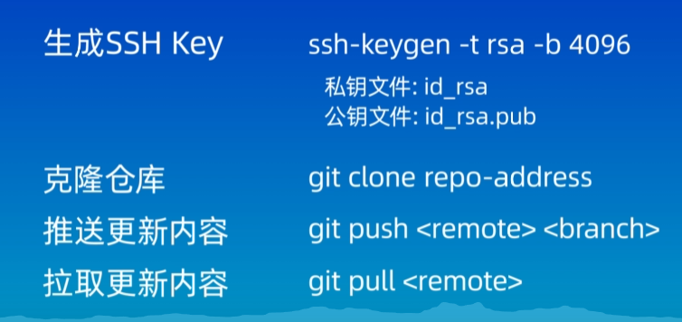

# git关于远程仓库的使用

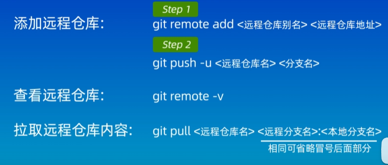

# 在vscode中使用git

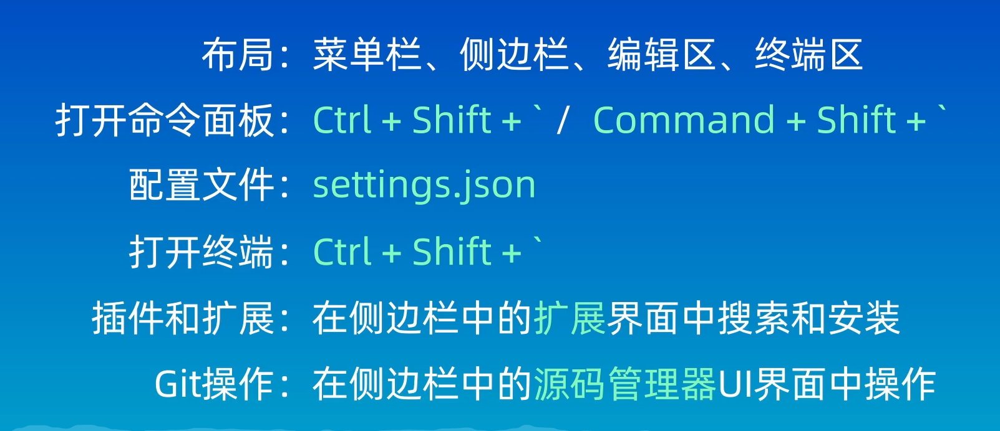

# git中分支操作

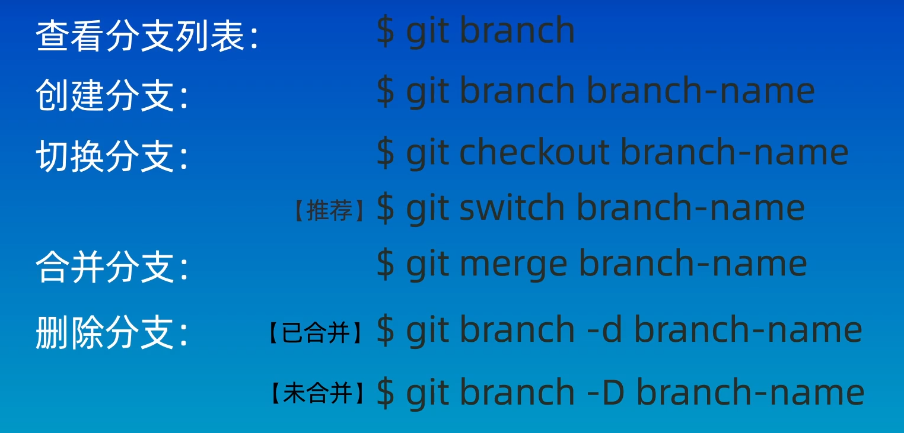

# git合并冲突如何解决

1. 出现如下错误

   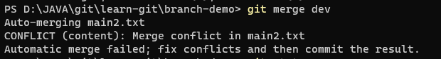

2. 使用 git status查看其状态

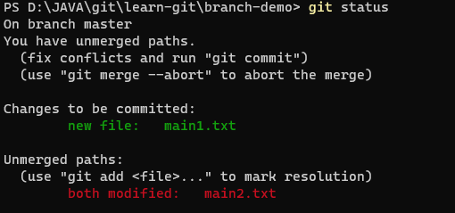

3.使用 git diff查看需要修改的地方

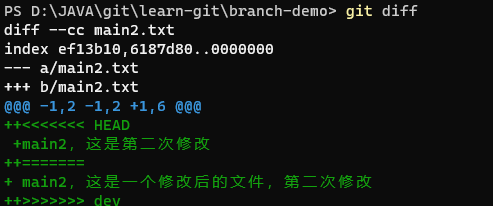

4.利用notepad main2.txt打开文件，去掉+<>=号后将两个句子合并到一起，最后再add和commit和git commit -m"merg"

# git中rebase的使用

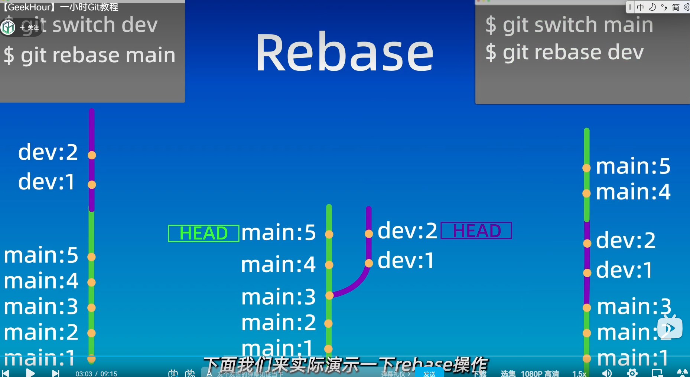

# git回溯

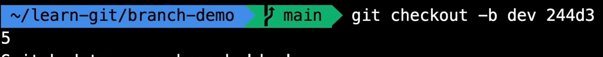

# git定义别名

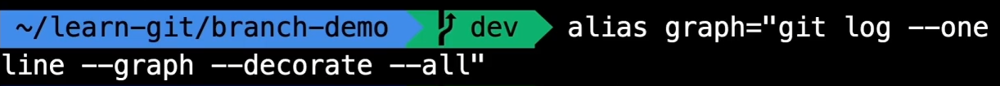

# 保持良好的git命名习惯

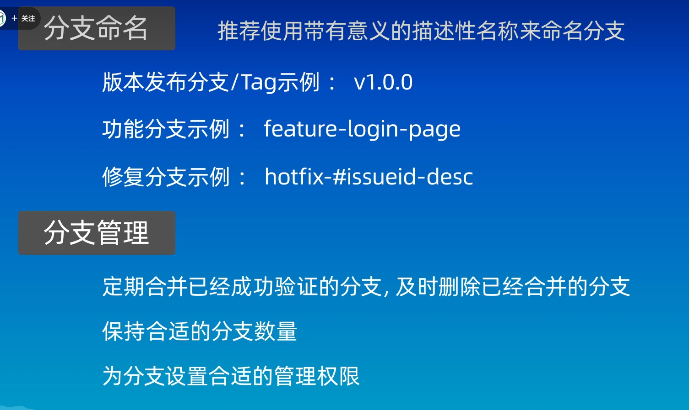
