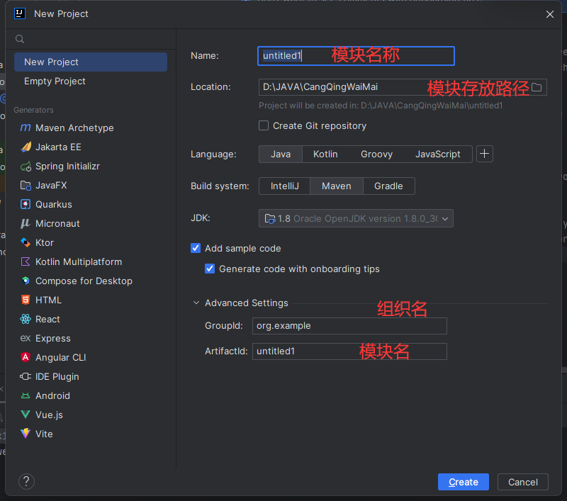
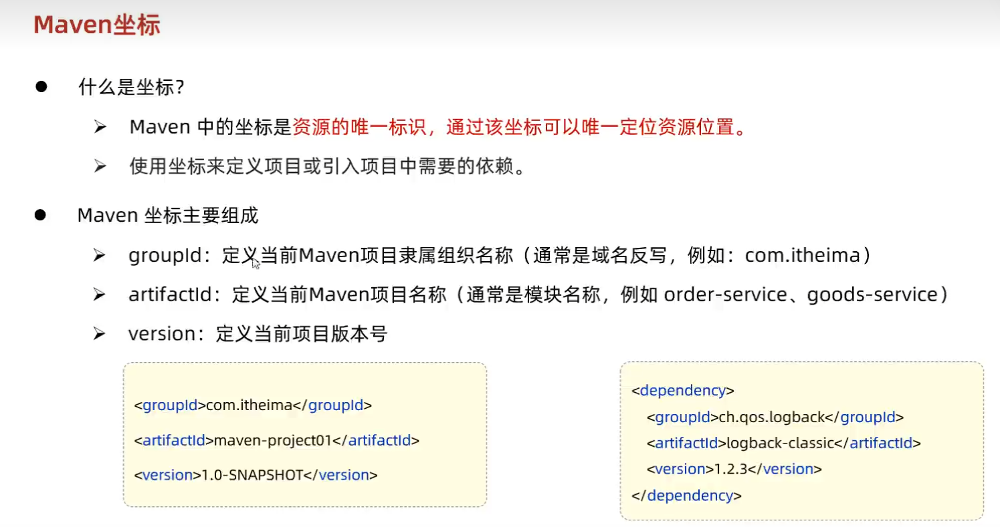
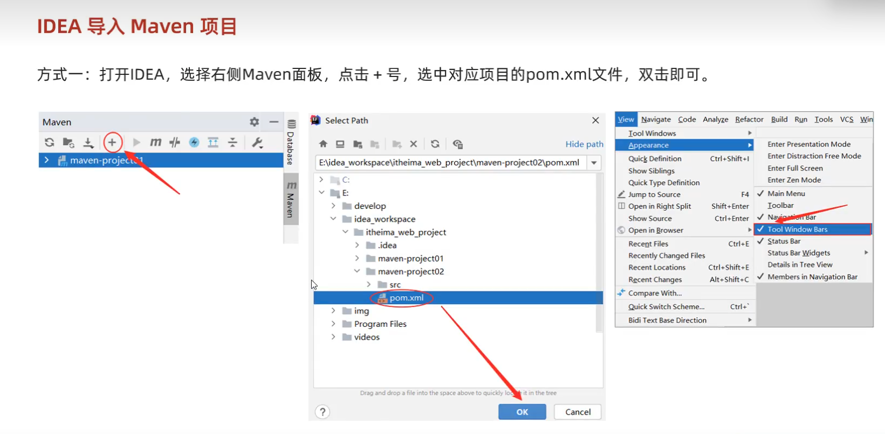
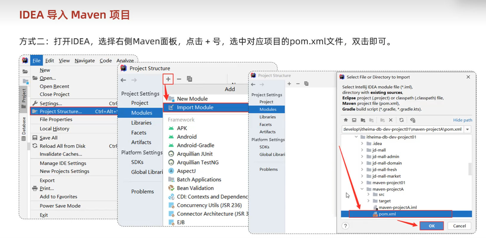

# 1.创建一个Maven项目



# Maven坐标



# 导入Maven工程的两种方式

1.

2.

# 注意：Maven在编译时出现如下错误

```java
Failed to execute goal on project XXXX: Could not resolve dependencies for project XXXX: Failed to collect dependencies at XXXX
```

出现这样的错误，是因为自己没有首先对父项目也就是sky-take-out项目进行clean和install ，执行父项目sky-take-out的clean和install，
